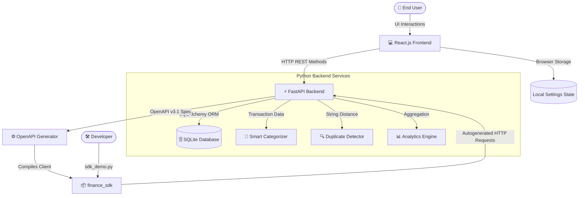

# Personal Finance Tracker

A full-fledged, production-ready Personal Finance Tracker built to demonstrate full-stack mastery, API precision, and ML-ready smart logic featuring a premium "Swiss Bank" minimalist aesthetic.

---

## System Architecture



### Technology Stack
- **Backend Core**: FastAPI, SQLAlchemy, Alembic (SQLite)
- **Frontend GUI**: React.js, TailwindCSS (v3), Chart.js
- **API Tooling**: OpenAPI Generator CLI
- **Testing**: PyTest with in-memory SQLite fixtures

---

## Core Application Features

1. **Smart Categorization Engine**: Dynamically auto-tags string descriptions ("Uber" → `transportation`, "McDonald's" → `dining`, etc.) automatically.
2. **Duplicate Anomaly Detection**: Advanced fuzzy-matching logic via `difflib` evaluates string similarity alongside amount variance (5%) within a rolling 30-minute deduplication threshold.
3. **Analytics & Aggregation Engine**: Pre-compiles complex financial metrics into grouped payload hashes (`Income`, `Expense`, `Net Cashflow`) mapping exclusively to the Dashboard for instantaneous retrieval.
4. **Premium Minimalist UI**: A stark, high-contrast, edge-to-edge React interface. Includes dynamic features like real-time state mutations, AI auto-suggest category buttons, inline row categorizations, and flat-file CSV exports.
5. **Profile & Currency Localization**: A global settings modal persists user identity and dynamically propagates chosen fiat currencies (`$`, `€`, `£`, `¥`) recursively down through every statistic card, input form, and rendering ledger row using strictly browser `localStorage`.
6. **Expandable Ledger Engine**: The layout dynamically shape-shifts! It toggles the Transaction entry widget off-screen enabling the central Ledger table to seamlessly span 100% full-width for extensive line-item financial review alongside date pagination.

---

## Quick Start (Windows Environment)

To instantly boot up and review this project, double-click or execute the bundled batch handlers in your root directory:

```powershell
:: 1. Build the Env, Map Database schemas via Alembic, and load massive SQL seed data
.\scripts\setupdev.bat

:: 2. Start the Frontend & Backend hot-reload servers alongside the OpenAPI compiler
.\scripts\runapplication.bat
```

> **Note:** The `runapplication.bat` script handles automatic python SDK generation directly against the live FastAPI spec! All you have to do is sit back and watch it compile.

### Verification Endpoints
- **React Client Application**: [http://localhost:3000](http://localhost:3000)
- **FastAPI OpenAPI Swagger UI**: [http://localhost:8000/docs](http://localhost:8000/docs)

---

## Testing & Python SDK Integration

### Executing the Unit Test Suite
A highly robust suite of PyTest validations exists covering the string categorization logic, duplicate transaction matching, strict state transitions (`PENDING` -> `VERIFIED`), and caching metrics calculations utilizing an isolated in-memory SQLite fixture.

```powershell
cd backend
# Execute the explicit virtual environment binary to correctly configure the pytest environment map
env\Scripts\python.exe -m pytest tests/
```

### Testing the Auto-Generated SDK
The `generate_sdk.py` script automatically places a raw, fully modeled `finance_sdk` interface library strictly bound to our endpoints in your root directory.
You can execute the bundled demonstration script to bypass the React client and hit the live backend API entirely via these exact SDK model abstractions!

*Note: The demo script forces `127.0.0.1` connectivity specifically to skirt a known `urllib3` bug on modern Windows distributions where `localhost` traffic is incorrectly routed to un-bound IPv6 loopbacks (`::1`).*

```powershell
# Run an end-to-end CRUD simulation using the generated python classes:
C:\Python313\python.exe sdk_demo.py --sdk
```

---

## PowerShell Troubleshooting Context

If you prefer to skip the `.bat` files and prefer initializing servers manually strictly within PowerShell, note that PowerShell executes sub-shells that **do not persist `.bat` environment variable context** back to your primary session. 

If you attempt to blindly run `pytest` or `uvicorn` and receive `ModuleNotFoundError: No module named 'pydantic_settings'`, you missed the virtual environment! You must explicitly call the virtual executable:

```powershell
# ❌ INCORRECT:
env\Scripts\activate.bat
uvicorn app.main:app

# ✅ CORRECT: Bypassing the Activate context errors entirely
C:\work\personal-finance-tracker\backend\env\Scripts\python.exe -m uvicorn app.main:app --host 127.0.0.1 --port 8000 --reload
```